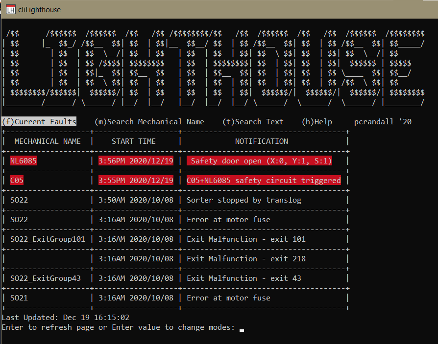
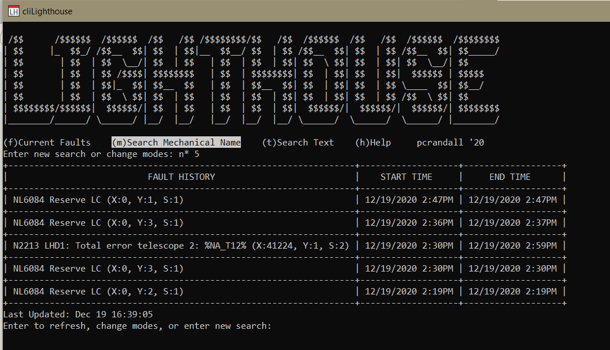
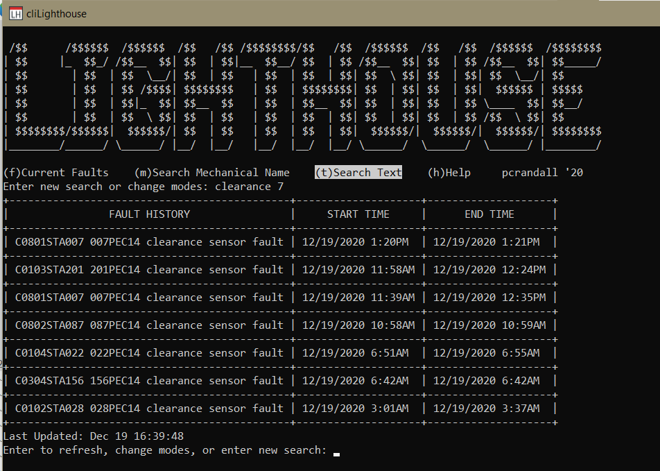

# Barebones client for SCADA system called "Lighthouse"

## CURRENT FAULTS
Will refresh automatically every 60 seconds or when Enter is pressed
Faults in the Matrix and C05 area will be highlighted in red.



## SEARCH MECHANICAL NAME


- USAGE: \<Search\>\<Space\><Amount(optional)>
- Searches are not case sensitive, wildcards are supported. Default number of values returned are 15
- If wildcards(*) are omitted only exact matches will be returned

  Examples:
  - 3 most recent faults for "NL3085": "nl3085 3"
  - 100 most recent faults in "C05": "c05* 100"
  - 15 most recent faults for "N1111": "n1111"
  - 10 most recent Navette faults: "n* 10"
  - 5 most recent Navette Lift faults: "nl* 5"
  - 15 most recent faults for "Sorter 1": "*so21*"
  - 10 most recent faults for all lifts ending in "82": "*82 10"

## SEARCH TEXT


- USAGE: \<Search\>\<Space\><Amount(optional)>
- You can refine text search using multiple keywords separated by "&&" for example "C05&&PEC 12"
- This will return 12 results with the text field containing "C05 and PEC"
- Searches ARE CASE sensitive. Wildcards are included by default. Default number of rows returned are 15.

  - Examples:
  - 5 most recent Safety Gate Open faults: "afet 5"
  - 7 most recent PEC faults: "PEC 7"
  - 15 most recent clearance sensor faults: "clearance 7"

## CONFIG FILE FORMAT

project uses go-bindata to embed ./config/config.yml into binary this allows for usage with single binary.

```yaml

cookie:
  host: <HOST URL>
  method: GET
  url: <URL>
  headers:
  # as many as you'd like to set
    -
      key: "HEADER TO SET"
      val: "VALUE"
    -
      key: "HEADER TO SET"
      val: "VALUE"
login:
  method: POST
  url: <URL>
  auth:
    un: <USERNAME>
    pw: <PASSWORD>
  headers:
  # as many as you'd like to set
    -
      key: "HEADER TO SET"
      val: "VALUE"
    -
      key: "HEADER TO SET"
      val: "VALUE"

historysearch:
  url: <URL>
  headers:
  # as many as you'd like to set
    -
      key: "HEADER TO SET"
      val: "VALUE"
    -
      key: "HEADER TO SET"
      val: "VALUE"
historytext:
  url: <URL>
  headers:
  # as many as you'd like to set
    -
      key: "HEADER TO SET"
      val: "VALUE"
    -
      key: "HEADER TO SET"
      val: "VALUE"

currentfaults:
  url: <URL>
  method: GET
  # as many as you'd like to set
    -
      key: "HEADER TO SET"
      val: "VALUE"
    -
      key: "HEADER TO SET"
      val: "VALUE"
machinenames:
  # as many as you'd like to set
- machinename1
- machinename2
```
